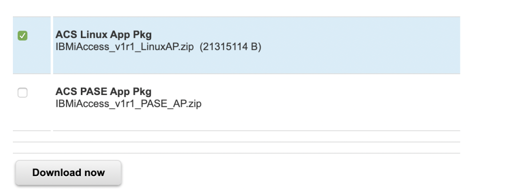

# pyodbc_db2_on_i
A quick repo to show how to connect Python client to IBM i

This repo is intended do document one example of connecting to DB2 on IBM system i.  I had explored ibm_db but had a lot of licensing issues, we are are going to explore the pyodbc python package instead.

markdown exmpales
This site was built using [GitHub Pages](https://pages.github.com/)

- George Washington
- John Adams
- Thomas Jefferson
## My Environment
* client   : IBM Power8 VM, RHEL 7.6 with Anaconda3 : kernel 4.14.0-115.8.1.el7a.ppc64le
* database : IBM i 7.4 with DB2 on Power8

## Client Setup 
Here were the steps and links to setup my client machine.
I referenced this link that had some good information also [IBMI Open Source Software ODBC](https://github.com/IBM/ibmi-oss-examples/blob/master/odbc/odbc.md)


### Install Anaconda3 Python
Follow the directions here .. [Install Anaconda Python3](https://docs.anaconda.com/anaconda/install/linux-power8/)

### Install IBM i Access - Client Solutions
Note, you will need an IBMid to login.  If you haven't already done so, create one.

Follow the links here is install this software.  This software will be used by the pyodbc python package to connect to DB2 on i over ODBC.  It provides the proper drivers.

[Install IBM i Access - Client Solutions](https://www.ibm.com/support/pages/ibm-i-access-client-solutions)

click here -> 

then sign in using your IBMid

Then select ACS for linux  and agree 

### Configure ACS software

If you downloaded the right file, you should have a file name something like this *IBMiAccess_v1r1_LinuxAP.zip*

Now run these commands to install
```unzip IBMiAccess_v1r1_LinuxAP.zip
cd ppcle64
yum install ibm-iaccess-1.1.0.12-1.0.ppc64le.rpm
```

### Python Setup
For python, I just needed to install pyodbc package
```pip install pyodbc```
and then experiment with creating a table, inserting some rows and reading it into pandas as a test.

I have 2 python files create_and_write_db.py and read_db.py.   These 2 files show some VERY BASIC commands but are enough to get you started ...


#### Create a table, and insert rows
Run the command below to create a schema and table names EXAMPLE_S.TMP and insert 2 rows into it.
```python create_and_write_db.py  ```

#### Read the table we created 
Run the command below to read out the data you added.  This should be enough to get started doing a lot more programmatic tasks with python.
```python read_db.py ```

# Summary
Congratulations, you should now be able to integrate your python applications with IBM DB2 on i

